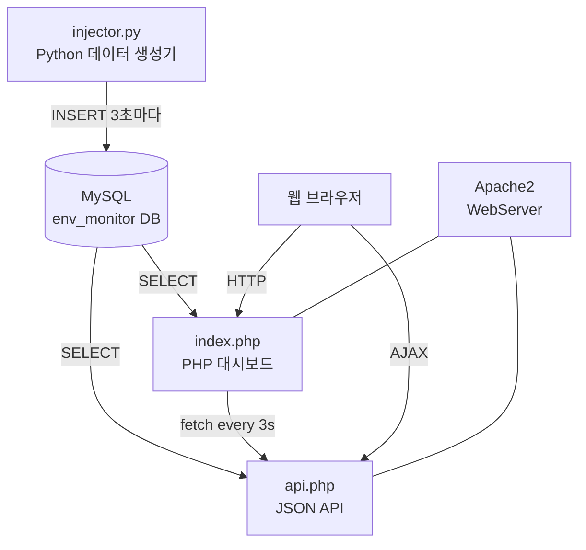

# 프로젝트 문서 — IoT 환경 센서 모니터링 시스템

---

## 1. 프로젝트 개요

본 프로젝트는 실험실, 사무실, 서버실, 야외 4개 위치에 설치된 환경 센서
(온도, 습도, CO₂, PM2.5)의 데이터를 실시간으로 수집·저장하고,
웹 대시보드에서 시각화하는 IoT 환경 모니터링 시스템입니다.

Python 스크립트(`injector.py`)가 현실적인 센서 데이터를 시뮬레이션하여
3초마다 MySQL 데이터베이스에 삽입하고,
PHP 웹 애플리케이션이 이를 조회하여 실시간 대시보드와 JSON API로 제공합니다.

---

## 2. 시스템 아키텍처



### 데이터 흐름

1. `injector.py`가 사인파 + 가우시안 노이즈로 현실적인 센서값을 생성합니다.
2. 생성된 데이터는 3초마다 MySQL `sensor_data` 테이블에 INSERT됩니다.
3. 웹 브라우저가 `index.php`를 요청하면 Apache2가 PHP를 실행합니다.
4. `index.php`는 MySQL에서 최신 데이터와 최근 기록을 조회해 HTML 대시보드를 렌더링합니다.
5. 브라우저는 JavaScript로 3초마다 페이지를 자동 갱신합니다.
6. `api.php`는 JSON 형식으로 같은 데이터를 제공하여 외부 연동을 지원합니다.

---

## 3. 기술 스택

| 역할 | 기술 |
|------|------|
| 데이터 생성 | Python 3, pymysql, math(사인파), random(노이즈) |
| 데이터베이스 | MySQL (InnoDB, utf8mb4) |
| 웹 서버 | Apache2 |
| 백엔드 | PHP 8.x, MySQLi 확장 |
| 프론트엔드 | Bootstrap 5 (CDN), 순수 JavaScript |
| 스타일 | CSS3 (다크 테마, CSS 변수, 애니메이션) |
| 배포 자동화 | Bash 셸 스크립트 |

---

## 4. 데이터베이스 스키마

### 데이터베이스: `env_monitor`

#### 테이블: `sensor_data`

| 컬럼 | 타입 | 설명 |
|------|------|------|
| `id` | INT AUTO_INCREMENT PK | 고유 식별자 |
| `location` | VARCHAR(50) NOT NULL | 측정 위치 (실험실/사무실/서버실/야외) |
| `temperature` | DECIMAL(5,2) NOT NULL | 온도 (°C) |
| `humidity` | DECIMAL(5,2) NOT NULL | 습도 (%) |
| `co2` | INT NOT NULL | CO₂ 농도 (ppm) |
| `pm25` | DECIMAL(6,2) NOT NULL | 미세먼지 PM2.5 (µg/m³) |
| `recorded_at` | TIMESTAMP DEFAULT NOW | 기록 시각 |

#### 인덱스

- `idx_location` : `location` 컬럼 — 위치별 최신 데이터 조회 최적화
- `idx_recorded_at` : `recorded_at` 컬럼 — 시계열 정렬 조회 최적화

---

## 5. 파일 구조

```
em_linux/
├── db.php          MySQL 접속 정보 및 연결 객체 초기화
├── index.php       실시간 웹 대시보드 (Bootstrap 5 다크 테마)
│                   - 4개 위치 센서 카드
│                   - 평균값 통계 바
│                   - 최근 20개 기록 테이블
│                   - 3초 자동 갱신 (JavaScript)
├── api.php         JSON REST API
│                   - GET /api.php → 위치별 최신 데이터 + 최근 20개 + 통계
├── injector.py     Python 데이터 생성기
│                   - 사인파 + 가우시안 노이즈 기반 현실적 시뮬레이션
│                   - 3초 주기 INSERT
│                   - 최대 1000개 레코드 유지
├── setup.sh        초기 설정 자동화 스크립트
├── README.md       사용 설명서 (Korean)
├── process.md      프로젝트 문서 (이 파일)
└── submission.txt  제출 정보
```

---

## 6. 단계별 설치 가이드

### 사전 요구 사항 설치

```bash
sudo apt-get update
sudo apt-get install -y mysql-server apache2 php php-mysqli python3-pip
sudo pip3 install pymysql
```

### 1단계: 프로젝트 디렉터리 확인

```bash
ls /home/changyeon/em_linux/
# db.php  index.php  api.php  injector.py  setup.sh  README.md  process.md  submission.txt
```

### 2단계: setup.sh 실행 (DB + Apache 설정)

```bash
cd /home/changyeon/em_linux
sudo bash setup.sh
```

성공 시 출력:
```
[OK]    DB(env_monitor), 사용자(env_user), 테이블(sensor_data) 생성 완료
[OK]    파일 권한 설정 완료
[OK]    Apache2 재시작 완료
============================================================
  설정 완료!
  대시보드 URL:  http://localhost/env_monitor
```

### 3단계: injector.py 실행

```bash
python3 /home/changyeon/em_linux/injector.py
```

출력 예시:
```
[2026-03-19 10:00:00] ── Cycle #1 ──────────────────────
  실험실 | 온도:  22.3°C  습도:  51.2%  CO₂:  643ppm  PM2.5:  11.8µg/m³
  사무실 | 온도:  25.7°C  습도:  57.4%  CO₂:  912ppm  PM2.5:  17.3µg/m³
  서버실 | 온도:  29.1°C  습도:  42.6%  CO₂:  501ppm  PM2.5:   8.4µg/m³
  야외   | 온도:  18.5°C  습도:  68.3%  CO₂:  418ppm  PM2.5:  43.6µg/m³
```

### 4단계: 대시보드 접속

브라우저에서 `http://localhost/env_monitor` 접속

- 센서 카드에 실시간 측정값과 상태(정상/주의/위험)가 표시됩니다.
- 3초마다 자동으로 갱신됩니다.
- JSON API: `http://localhost/env_monitor/api.php`

---

## 7. 센서 데이터 생성 알고리즘

`injector.py`는 단순한 난수가 아닌 현실적인 환경 데이터를 생성합니다.

```
측정값 = 기준값 + 사인파(시간 변화) + 가우시안 노이즈(불규칙성)
```

- **사인파**: 1시간 주기로 완만하게 변화 (낮/밤, 냉난방 사이클 반영)
- **가우시안 노이즈**: 실제 센서의 미세한 변동 반영
- **재실 패턴**: 사무실/실험실의 CO₂는 9–18시에 상승
- **출퇴근 효과**: 야외 PM2.5는 07–09시, 17–19시에 상승
- **온습도 역상관**: 온도가 높아지면 상대 습도가 낮아지는 경향 반영
